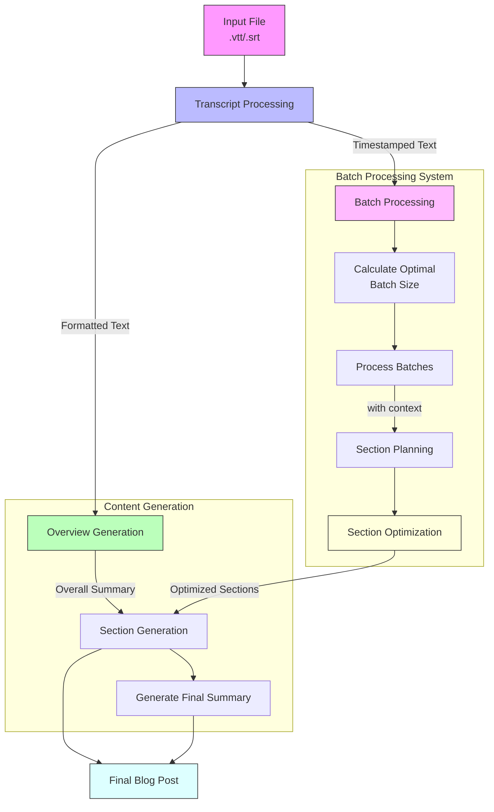

# Transcript to Blog Post Generator

This project, inspired by Sam Witteveen's video "New Summarization via In Context Learning with a New Class of Models," implements an advanced transcript processing system with Context-Aware capabilities. This system converts video/audio transcripts into well-structured blog posts using LLM-based sectioning techniques.

## Overview

The system implements an advanced batch-processing approach for transforming long-form transcripts into structured blog content. It uses Google's Gemini models (Flash and Pro) in a multi-stage pipeline that ensures both efficiency and coherence. The system is particularly notable for its sophisticated batch processing and section optimization capabilities.

The process begins with flexible input handling (supporting both VTT and SRT formats) and proceeds through a carefully orchestrated series of stages. Each stage maintains temporal context and content relationships while optimizing for processing efficiency. The system employs dynamic batch sizing based on content characteristics and implements an importance-based section selection process to ensure the most relevant content is preserved in the final output.

Key innovations include:
- Parallel processing capabilities with context preservation
- Dynamic optimization of content sections based on configurable parameters
- Dual-model approach using Gemini Flash for general content and Gemini Pro for detailed planning
- Comprehensive timestamp integration throughout the process

The result is a system that can reliably transform long-form transcripts into well-structured, coherent blog posts while maintaining the temporal relationships present in the original content. The final output includes an overview, optimized content sections, and a concluding summary, all with preserved timestamp references for easy alignment with the source material.



## Key Features

- **Multi-Format Support**: Handles both VTT and SRT transcript formats
- **Batch Processing System**: 
  - Dynamic batch size calculation based on content length
  - Maintains context between batches for coherent processing
  - Parallel processing capabilities
- **Smart Section Optimization**:
  - Configurable maximum section limit
  - Importance-based section selection
  - Duration and content-aware optimization
- **Context-Aware Generation**:
  - Maintains previous context across batch processing
  - Ensures coherent transitions between sections
  - Preserves timestamp information throughout
- **Comprehensive Content Structure**:
  - Overview summary
  - Optimized, timestamped sections
  - Final thoughts and conclusions

## How It Works

1. **Initial Processing**
   - Parses input file (VTT/SRT)
   - Extracts timestamps and text
   - Creates two formats: plain text and timestamped text

2. **Overview Generation**
   - Uses Gemini Flash model to create comprehensive summary
   - Processes initial content chunk (up to 10,000 characters)
   - Sets context for subsequent section generation

3. **Batch Processing & Planning**
   - Calculates optimal batch size based on content length
   - Processes transcript in manageable chunks
   - Maintains context between consecutive batches
   - Generates section outlines with timestamps

4. **Section Optimization**
   - Evaluates sections based on importance metrics
   - Considers content length and duration
   - Optimizes to meet configured maximum section limit
   - Preserves most significant content

5. **Content Generation**
   - Processes each optimized section with full context
   - Incorporates overall summary and previous section content
   - Maintains coherence between sections
   - Generates final summary to conclude the blog post

6. **Output Generation**
   - Creates structured markdown file
   - Includes overview, timestamped sections, and conclusions
   - Preserves all temporal references for content alignment

## Technical Implementation

The project uses:
- `langchain` for LLM integration
- Google's Gemini models (Flash and Pro variants)
- Pydantic for structured data handling
- WebVTT for transcript parsing

## Output Files and Artifacts

### Generated Content Files

- `generated_blog.md`
  - Primary output file containing the full blog post
  - Includes:
    * Comprehensive overview section
    * Timestamped content sections
    * Final thoughts/conclusion
  - Formatted in markdown for easy editing and publishing

- `blog_with_screenshots.md`
  - Enhanced version of the blog post
  - Includes visual elements:
    * Embedded screenshots from the source video
    * Thumbnail image
    * Preserves all formatting from `generated_blog.md`

### Metadata and Supporting Files

- `blog_outline.json`
  - Structured JSON representation of the blog content
  - Contains:
    * Section titles
    * Start and end timestamps
    * Section summaries
  - Useful for programmatic processing or further analysis

### Screenshot Artifacts

- `screenshots/`
  - Directory containing all generated screenshots
  - Includes:
    * Individual section screenshots
    * Video thumbnail
  - Naming convention: 
    * Section screenshots: `screenshot_HH_MM_SS.png`
    * Thumbnail: `thumbnail.png`

### Logging and Debug Files

- Potential additional debug logs may be generated during processing
- Check console output for detailed processing information

### File Relationships

```
output/
├── generated_blog.md
├── blog_with_screenshots.md
├── blog_outline.json
└── screenshots/
    ├── thumbnail.png
    ├── screenshot_00_05_10.png
    └── ...
```

### Recommended Workflow

1. Review `generated_blog.md` for initial content
2. Check `blog_outline.json` for structural insights
3. Verify screenshots in the `screenshots/` directory
4. Use `blog_with_screenshots.md` for final publication

## Requirements

- Python 3.x
- Google API credentials
- Required packages listed in `requirements.txt`

## Setup and Configuration

1. Install required packages:
```bash
pip install -r requirements.txt
```

2. Configure your Google API key:
   - Get a Gemini API key from [Google AI Studio](https://makersuite.google.com/app/apikey)
   - Set it as an environment variable:
   ```bash
   export GOOGLE_API_KEY='your-api-key-here'
   ```
   - Or add it to your ~/.bashrc for persistence:
   ```bash
   echo 'export GOOGLE_API_KEY="your-api-key-here"' >> ~/.bashrc
   source ~/.bashrc
   ```

3. Configure settings in `config.py`:
   - Adjust file paths (INPUT_VTT, INPUT_MARKDOWN, etc.)
   - Set batch sizes for processing
   - Update YouTube URL

## Usage

### Prerequisites

- Python 3.8+
- Google Cloud account with Gemini API access
- Required Python packages (install via `pip install -r requirements.txt`)

### Setup

1. **Clone the Repository**
   ```bash
   git clone https://github.com/monkinng9/Transcript2blog-sectioning-technique.git
   cd Transcript2blog-sectioning-technique.git
   ```

2. **Install Dependencies**
   ```bash
   pip install -r requirements.txt
   ```

3. **Set Up Google API Key**
   - Obtain a Gemini API key from Google Cloud Console
   - Set the environment variable:
     ```bash
     export GOOGLE_API_KEY='your_api_key_here'
     ```

### Configuration

Edit `config.py` to customize your blog generation:

- `INPUT`: Choose between VTT or SRT input file
- `MAX_SECTIONS`: Limit the number of blog sections
- `MIN_SECTION_DURATION`: Minimum duration for a section
- `TARGET_SECTION_DURATION`: Ideal section duration
- `YOUTUBE_URL`: Source video URL for screenshot generation

### Running the Tool

1. **Prepare Transcript**
   - Download subtitles using `yt-dlp`:
     ```bash
     yt-dlp --write-auto-subs --sub-format srt --convert-subs srt --skip-download "YOUR_YOUTUBE_URL"
     ```

2. **Generate Blog**
   ```bash
   python script_01.py  # Generate blog sections
   python script_02.py  # Add screenshots
   python script_03.py  # Convert blog to Word document
   ```

### Output

- `generated_blog.md`: Generated blog post
- `blog_outline.json`: Structured blog section metadata
- `blog_with_screenshots.md`: Blog with embedded screenshots
- `screenshots/`: Directory containing generated screenshots
- `blog_with_screenshots.docx`: Blog with embedded screenshots in Word document format

### Customization Tips

- Adjust `TRANSCRIPT_BATCH_SIZE` for different processing granularity
- Modify prompt templates in scripts for different writing styles
- Experiment with Gemini model parameters for varied outputs

### Troubleshooting

- Ensure correct API key and permissions
- Check transcript file format (VTT/SRT)
- Verify YouTube URL accessibility
- Review console output for detailed processing information