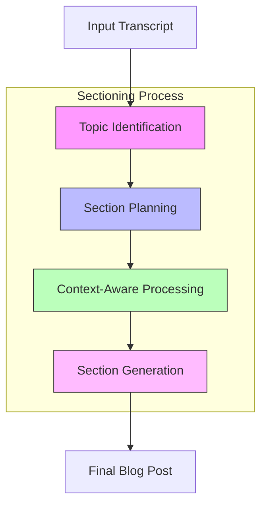

# Transcript to Blog Post Generator

This project, inspired by Sam Witteveen's video "New Summarization via In Context Learning with a New Class of Models," implements an advanced transcript processing system with Context-Aware capabilities. This system converts video/audio transcripts into well-structured blog posts using LLM-based sectioning techniques.

## Overview

The system uses a novel sectioning approach to process long-form transcripts efficiently while maintaining context and coherence. It leverages Google's Gemini models to generate high-quality blog content through a multi-stage process.



## Key Features

- **Smart Sectioning**: Automatically identifies natural topic boundaries in the transcript
- **Context-Aware Processing**: Maintains full document context while generating section summaries
- **Structured Output**: Generates well-organized blog posts with:
  - Overview summary
  - Timestamped sections
  - Final thoughts and conclusions

## How It Works

1. **Transcript Processing**
   - Parses VTT format transcripts
   - Maintains timestamp information
   - Converts to processable text format

2. **Planning Phase**
   - Generates comprehensive overview
   - Creates structured section outline
   - Identifies key themes and transitions

3. **Content Generation**
   - Processes each section with full context
   - Maintains coherence between sections
   - Includes timestamp references

## Technical Implementation

The project uses:
- `langchain` for LLM integration
- Google's Gemini models (Flash and Pro variants)
- Pydantic for structured data handling
- WebVTT for transcript parsing

## Output

The system generates:
- A structured blog post in Markdown format
- JSON outline of the content structure
- Timestamped sections for easy reference

## Requirements

- Python 3.x
- Google API credentials
- Required packages listed in `requirements.txt`

## Setup and Configuration

1. Install required packages:
```bash
pip install -r requirements.txt
```

2. Configure your Google API key:
   - Get a Gemini API key from [Google AI Studio](https://makersuite.google.com/app/apikey)
   - Set it as an environment variable:
   ```bash
   export GOOGLE_API_KEY='your-api-key-here'
   ```
   - Or add it to your ~/.bashrc for persistence:
   ```bash
   echo 'export GOOGLE_API_KEY="your-api-key-here"' >> ~/.bashrc
   source ~/.bashrc
   ```

3. Configure settings in `config.py`:
   - Adjust file paths (INPUT_VTT, INPUT_MARKDOWN, etc.)
   - Set batch sizes for processing
   - Update YouTube URL

## Usage

1. Place your VTT transcript file according to the path specified in `config.py`

2. Generate the initial blog post:
```bash
python script_01.py
```

3. Add screenshots to the blog post:
```bash
python script_02.py
```

4. (Optional) Convert to Word document:
```bash
python script_03.py blog_with_screenshots.md output.docx
```

## Output Files

- `generated_blog.md`: The final blog post
- `blog_outline.json`: Structured outline of the content

## Architecture Benefits

- **Improved Context**: Maintains document-wide understanding
- **Better Coherence**: Generates more cohesive content
- **Efficient Processing**: Optimizes LLM token usage
- **Scalability**: Handles long-form content effectively
