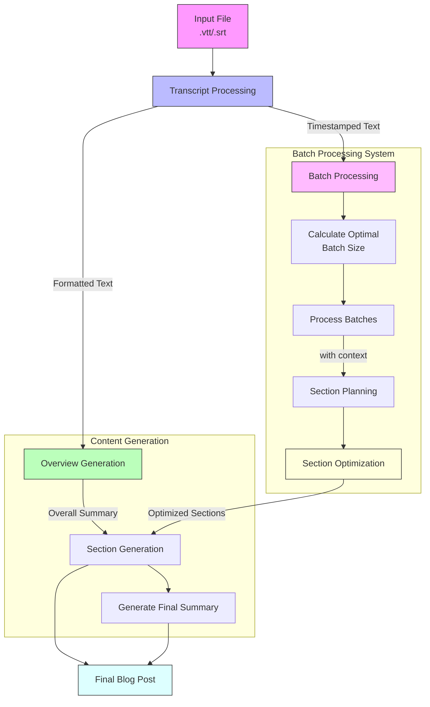

# Transcript to Blog Post Generator

This project, inspired by Sam Witteveen's video "New Summarization via In Context Learning with a New Class of Models," implements an advanced transcript processing system with Context-Aware capabilities. This system converts video/audio transcripts into well-structured blog posts using LLM-based sectioning techniques.

## Overview

The system implements an advanced batch-processing approach for transforming long-form transcripts into structured blog content. It uses Google's Gemini models (Flash and Pro) in a multi-stage pipeline that ensures both efficiency and coherence. The system is particularly notable for its sophisticated batch processing and section optimization capabilities.

The process begins with flexible input handling (supporting both VTT and SRT formats) and proceeds through a carefully orchestrated series of stages. Each stage maintains temporal context and content relationships while optimizing for processing efficiency. The system employs dynamic batch sizing based on content characteristics and implements an importance-based section selection process to ensure the most relevant content is preserved in the final output.

Key innovations include:
- Parallel processing capabilities with context preservation
- Dynamic optimization of content sections based on configurable parameters
- Dual-model approach using Gemini Flash for general content and Gemini Pro for detailed planning
- Comprehensive timestamp integration throughout the process

The result is a system that can reliably transform long-form transcripts into well-structured, coherent blog posts while maintaining the temporal relationships present in the original content. The final output includes an overview, optimized content sections, and a concluding summary, all with preserved timestamp references for easy alignment with the source material.



## Key Features

- **Multi-Format Support**: Handles both VTT and SRT transcript formats
- **Batch Processing System**: 
  - Dynamic batch size calculation based on content length
  - Maintains context between batches for coherent processing
  - Parallel processing capabilities
- **Smart Section Optimization**:
  - Configurable maximum section limit
  - Importance-based section selection
  - Duration and content-aware optimization
- **Context-Aware Generation**:
  - Maintains previous context across batch processing
  - Ensures coherent transitions between sections
  - Preserves timestamp information throughout
- **Comprehensive Content Structure**:
  - Overview summary
  - Optimized, timestamped sections
  - Final thoughts and conclusions

## How It Works

1. **Initial Processing**
   - Parses input file (VTT/SRT)
   - Extracts timestamps and text
   - Creates two formats: plain text and timestamped text

2. **Overview Generation**
   - Uses Gemini Flash model to create comprehensive summary
   - Processes initial content chunk (up to 10,000 characters)
   - Sets context for subsequent section generation

3. **Batch Processing & Planning**
   - Calculates optimal batch size based on content length
   - Processes transcript in manageable chunks
   - Maintains context between consecutive batches
   - Generates section outlines with timestamps

4. **Section Optimization**
   - Evaluates sections based on importance metrics
   - Considers content length and duration
   - Optimizes to meet configured maximum section limit
   - Preserves most significant content

5. **Content Generation**
   - Processes each optimized section with full context
   - Incorporates overall summary and previous section content
   - Maintains coherence between sections
   - Generates final summary to conclude the blog post

6. **Output Generation**
   - Creates structured markdown file
   - Includes overview, timestamped sections, and conclusions
   - Preserves all temporal references for content alignment

## Technical Implementation

The project uses:
- `langchain` for LLM integration
- Google's Gemini models (Flash and Pro variants)
- Pydantic for structured data handling
- WebVTT for transcript parsing

## Output

The system generates:
- A structured blog post in Markdown format
- JSON outline of the content structure
- Timestamped sections for easy reference

## Requirements

- Python 3.x
- Google API credentials
- Required packages listed in `requirements.txt`

## Setup and Configuration

1. Install required packages:
```bash
pip install -r requirements.txt
```

2. Configure your Google API key:
   - Get a Gemini API key from [Google AI Studio](https://makersuite.google.com/app/apikey)
   - Set it as an environment variable:
   ```bash
   export GOOGLE_API_KEY='your-api-key-here'
   ```
   - Or add it to your ~/.bashrc for persistence:
   ```bash
   echo 'export GOOGLE_API_KEY="your-api-key-here"' >> ~/.bashrc
   source ~/.bashrc
   ```

3. Configure settings in `config.py`:
   - Adjust file paths (INPUT_VTT, INPUT_MARKDOWN, etc.)
   - Set batch sizes for processing
   - Update YouTube URL

## Usage

1. Download Trascript with `yt-dlp`
```bash
pip install yt-dlp
yt-dlp --write-subs --sub-format srt --convert-subs srt --skip-download "VIDEO_URL"

# for auto sub
# yt-dlp --write-auto-subs --sub-format srt --convert-subs srt --skip-download "VIDEO_URL" --output "transcript"
```

2. Place your VTT transcript file according to the path specified in `config.py`

3. Generate the initial blog post:
```bash
python script_01.py
```

4. Add screenshots to the blog post:
```bash
python script_02.py
```

5. (Optional) Convert to Word document:
```bash
python script_03.py blog_with_screenshots.md output.docx
```

## Screenshot Capture Optimization

### Concurrent Processing
The screenshot capture mechanism has been optimized for high-performance, parallel processing:

- **Concurrent Capture**: Supports simultaneous screenshot extraction from YouTube videos
- **Controlled Concurrency**: Limits concurrent captures to prevent system overload
- **Robust Error Handling**: 
  - Implements automatic retry mechanism
  - Provides detailed logging for debugging
  - Graceful error management

### Performance Features
- Maximum 3 concurrent screenshot captures
- Up to 3 retry attempts for each screenshot
- Configurable semaphore-based concurrency control
- Detailed logging with timestamps and error levels

### Usage Example
```python
timestamps = [("00:00:10", "screenshot1.jpg"), ("00:00:20", "screenshot2.jpg")]
results = await process_screenshots_batch("https://youtube.com/watch?v=xxx", timestamps)
```

## Output Files

- `generated_blog.md`: The final blog post
- `blog_outline.json`: Structured outline of the content

## Architecture Benefits

- **Improved Context**: Maintains document-wide understanding
- **Better Coherence**: Generates more cohesive content
- **Efficient Processing**: Optimizes LLM token usage
- **Scalability**: Handles long-form content effectively
